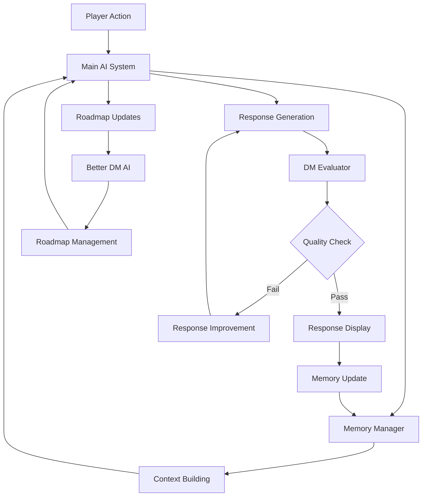

# DiceTales AI Systems Overview

## Introduction

DiceTales employs a sophisticated ecosystem of AI systems working together to create immersive, intelligent, and adaptive tabletop RPG experiences. This document provides an overview of all AI components and their interactions within the DiceTales platform.

## AI System Architecture

```
DiceTales AI Ecosystem
├── Main AI System (ai.js)
│   ├── HuggingFace Integration
│   ├── Response Generation
│   ├── Context Management
│   └── Setting Adaptation
├── Memory Manager (memoryManager.js)
│   ├── Persistent Memory Storage
│   ├── Context Building
│   ├── Information Extraction
│   └── Memory Cleanup
├── DM Evaluator (dmEvaluator.js)
│   ├── Response Quality Assessment
│   ├── Multi-Criteria Scoring
│   ├── Improvement Suggestions
│   └── Performance Tracking
└── Better DM AI (betterDMAI.js)
    ├── Campaign Roadmap Management
    ├── Advanced Story Planning
    ├── Dynamic Adaptation
    └── Quality Integration
```

## System Overview

### 🤖 Main AI System
**File**: `advanced/js/ai.js`  
**Primary Function**: Core storytelling engine and narrative generation

**Key Responsibilities**:
- HuggingFace API integration and management
- Dynamic story content generation
- Player action processing and response
- Setting-specific narrative adaptation
- Memory context integration
- Response quality enhancement

**Technology Stack**:
- HuggingFace Inference API
- Advanced conversational models (GODEL, BlenderBot, DialoGPT)
- Model fallback system for reliability
- Response post-processing pipeline

[📖 **Detailed Documentation**: AI_MAIN_SYSTEM.md](https://asleshsura.github.io/DiceTales/docs/AI_MAIN_SYSTEM)

---

### 🧠 Memory Manager
**File**: `advanced/js/memoryManager.js`  
**Primary Function**: Persistent memory and context management

**Key Responsibilities**:
- Long-term memory storage and retrieval
- Character relationship tracking
- World state persistence
- Decision consequence monitoring
- Automatic information extraction from AI responses
- Context building for AI prompts

**Memory Categories**:
- Player decisions and consequences
- NPC relationships and interactions
- World locations and descriptions
- Character skill usage patterns
- Quest progression and discoveries
- Significant plot developments

[📖 **Detailed Documentation**: AI_MEMORY_MANAGER.md](https://asleshsura.github.io/DiceTales/docs/AI_MEMORY_MANAGER)

---

### 📊 DM Evaluator
**File**: `advanced/js/dmEvaluator.js`  
**Primary Function**: AI response quality assessment and improvement

**Key Responsibilities**:
- Multi-dimensional response scoring
- Quality threshold monitoring
- Improvement suggestion generation
- Performance trend analysis
- Human-like storytelling assessment
- Continuous system optimization

**Evaluation Criteria**:
- Immersion & Atmosphere (25%)
- DM Personality (20%)
- Player Engagement (20%)
- Narrative Flow (15%)
- D&D Authenticity (10%)
- Creative Flair (10%)

[📖 **Detailed Documentation**: AI_DM_EVALUATOR.md](https://asleshsura.github.io/DiceTales/docs/AI_DM_EVALUATOR)

---

### 🗺️ Better DM AI
**File**: `better-dm/js/betterDMAI.js`  
**Primary Function**: Advanced campaign management and structured storytelling

**Key Responsibilities**:
- Campaign roadmap creation and management
- Long-term story arc planning
- Dynamic plot adaptation
- Enhanced NPC management
- Multi-chapter campaign coordination
- Quality assessment integration

**Advanced Features**:
- Structured story planning
- Character-specific narrative arcs
- Dynamic plot progression
- Intelligent story adaptation
- Campaign state management

[📖 **Detailed Documentation**: AI_BETTER_DM.md](https://asleshsura.github.io/DiceTales/docs/AI_BETTER_DM)

## System Interactions

### 🔄 Core Integration Flow



### 🤝 Component Collaboration

**Main AI ↔ Memory Manager**:
- AI requests context from Memory Manager
- Memory Manager extracts information from AI responses
- Bidirectional memory updating and context enhancement

**Main AI ↔ DM Evaluator**:
- AI responses evaluated for quality
- Evaluation feedback used for response improvement
- Performance metrics guide AI optimization

**Main AI ↔ Better DM AI**:
- Roadmap awareness in response generation
- Campaign structure integration
- Long-term narrative consistency

**Memory Manager ↔ DM Evaluator**:
- Memory context used in quality assessment
- Evaluation results inform memory significance
- Character development tracking

## Unified AI Configuration

### Global Settings
```javascript
AI_CONFIG = {
    // Main AI System
    HUGGINGFACE_MODELS: [
        'microsoft/GODEL-v1_1-large-seq2seq',
        'facebook/blenderbot-400M-distill',
        'microsoft/GODEL-v1_1-base-seq2seq',
        'facebook/blenderbot-1B-distill',
        'microsoft/DialoGPT-large',
        'microsoft/DialoGPT-medium',
        'gpt2-large',
        'distilgpt2'
    ],
    
    // Conversation Settings
    CONVERSATION_SETTINGS: {
        maxContextLength: 2048,
        temperature: 0.8,
        topP: 0.9,
        repetitionPenalty: 1.1,
        maxNewTokens: 150,
        doSample: true,
        numBeams: 3
    },
    
    // Memory Configuration
    MEMORY_SETTINGS: {
        maxConversationHistory: 20,
        plotContextWindow: 5,
        characterMemoryDepth: 10
    },
    
    // Quality Standards
    QUALITY_SETTINGS: {
        minimumScore: 6.5,
        evaluationEnabled: true,
        autoImprovement: true,
        detailedLogging: true
    },
    
    // Better DM Configuration
    CAMPAIGN_SETTINGS: {
        chaptersPerCampaign: 5,
        sessionsPerChapter: 3,
        adaptationLevel: 'high',
        roadmapFlexibility: 'moderate'
    }
};
```

## Cross-System Features

### 🎯 Setting-Specific Adaptation
All AI systems adapt their behavior based on campaign settings:

**Medieval Fantasy**:
- Traditional D&D terminology and concepts
- Fantasy races, magic, and medieval technology
- Classic adventure tropes and scenarios

**Modern/Urban Fantasy**:
- Contemporary settings with supernatural elements
- Modern technology and urban environments
- Investigation and conspiracy themes

**Sci-Fi Space**:
- Futuristic technology and space travel
- Alien encounters and cosmic mysteries
- Science fiction concepts and terminology

**Eldritch Horror**:
- Cosmic horror and sanity mechanics
- Academic investigation themes
- Lovecraftian atmosphere and terminology

### 🧠 Unified Memory Context
All systems contribute to and benefit from unified memory:

```javascript
// Comprehensive context shared across all AI systems
const unifiedContext = {
    character: characterData,
    campaign: campaignData,
    memory: memoryManager.buildMemoryContext(),
    quality: dmEvaluator.getQualityMetrics(),
    roadmap: betterDM?.getCurrentRoadmapState(),
    setting: settingSpecificData
};
```

### 📊 Integrated Quality Monitoring
Quality assessment spans all AI systems:

- Main AI responses evaluated for storytelling quality
- Memory Manager context relevance scored
- Better DM roadmap adherence measured
- Overall system performance tracked

## Development and Testing

### 🔧 Debug and Testing Tools
```javascript
// Global testing functions available in browser console
testAI()                    // Test Main AI System
testMemory()               // Test Memory Manager
testEvaluation()           // Test DM Evaluator
testBetterDM()             // Test Better DM AI
testAIEcosystem()          // Test entire AI ecosystem
```

### 📈 Performance Monitoring
```javascript
// Comprehensive performance tracking
const systemMetrics = {
    mainAI: {
        responseTime: '2.3s',
        qualityScore: 7.8,
        successRate: 0.94
    },
    memoryManager: {
        contextBuildTime: '0.1s',
        memoryAccuracy: 0.96,
        storageEfficiency: 0.88
    },
    dmEvaluator: {
        evaluationTime: '0.3s',
        scoringAccuracy: 0.92,
        improvementRate: 0.15
    },
    betterDM: {
        roadmapCoherence: 0.89,
        adaptationSuccess: 0.91,
        playerSatisfaction: 8.2
    }
};
```

## Best Practices for AI Integration

### 🎯 System Coordination
1. **Consistent Data Flow**: Ensure all systems receive consistent, up-to-date information
2. **Error Handling**: Implement graceful degradation when individual systems fail
3. **Performance Balance**: Optimize for overall system performance, not individual components
4. **Quality Standards**: Maintain consistent quality expectations across all AI systems

### 🧠 Memory Management
1. **Relevance Filtering**: Include only relevant memories for current context
2. **Information Hierarchy**: Prioritize recent and significant events
3. **Cross-System Consistency**: Ensure memory updates are reflected across all systems
4. **Storage Optimization**: Manage memory size for performance and relevance

### 📊 Quality Assurance
1. **Multi-System Evaluation**: Assess quality across the entire AI ecosystem
2. **Continuous Improvement**: Use evaluation data to enhance all systems
3. **Player Feedback Integration**: Incorporate user satisfaction into quality metrics
4. **Performance Monitoring**: Track and optimize system-wide performance

## Troubleshooting AI Systems

### 🔍 Common Issues and Solutions

**AI Response Quality Issues**:
1. Check Main AI System model availability
2. Verify Memory Manager context building
3. Review DM Evaluator scoring criteria
4. Assess Better DM roadmap integration

**Memory Persistence Problems**:
1. Validate game state storage functionality
2. Check memory structure integrity
3. Verify cross-system memory sharing
4. Review memory cleanup algorithms

**Performance Degradation**:
1. Monitor AI API response times
2. Check memory context size optimization
3. Assess evaluation processing overhead
4. Review system integration efficiency

**System Integration Failures**:
1. Verify all AI systems are properly initialized
2. Check cross-system communication pathways
3. Validate shared configuration consistency
4. Test fallback mechanisms

### 🛠️ Debug Commands
```javascript
// Comprehensive system diagnostics
debugAIEcosystem({
    includePerformanceMetrics: true,
    validateIntegration: true,
    checkMemoryConsistency: true,
    assessQualityStandards: true,
    testFallbackSystems: true
});
```

## Future AI Development

### 🚀 Planned Enhancements
1. **Machine Learning Integration**: Adaptive learning across all AI systems
2. **Advanced NPC AI**: Individual AI personalities for major NPCs
3. **Cross-Campaign Learning**: Knowledge transfer between different campaigns
4. **Real-time Optimization**: Dynamic system parameter adjustment
5. **Player Preference Learning**: Personalized AI behavior adaptation

### 🔬 Research Areas
1. **Emergent Storytelling**: AI-generated story elements beyond roadmaps
2. **Emotional AI**: Character and NPC emotional state modeling
3. **Predictive Narrative**: Anticipating player preferences and choices
4. **Collaborative AI**: Multiple AI systems working together for complex scenarios
5. **Natural Language Understanding**: Enhanced comprehension of player intentions

## Conclusion

The DiceTales AI ecosystem represents a sophisticated integration of multiple specialized AI systems, each contributing unique capabilities to create immersive, intelligent, and adaptive tabletop RPG experiences. Through careful coordination of the Main AI System, Memory Manager, DM Evaluator, and Better DM AI, DiceTales delivers human-like storytelling that maintains consistency, quality, and engagement across extended gaming sessions.

The modular design allows for independent development and optimization of each system while maintaining seamless integration and shared intelligence. This architecture ensures both current performance excellence and future extensibility as AI technology continues to evolve.

---

**For detailed information about specific AI systems, please refer to their individual documentation:**
- [Main AI System Documentation](https://asleshsura.github.io/DiceTales/docs/AI_MAIN_SYSTEM)
- [Memory Manager Documentation](https://asleshsura.github.io/DiceTales/docs/AI_MEMORY_MANAGER)
- [DM Evaluator Documentation](https://asleshsura.github.io/DiceTales/docs/AI_DM_EVALUATOR)
- [Better DM AI Documentation](https://asleshsura.github.io/DiceTales/docs/AI_BETTER_DM)
